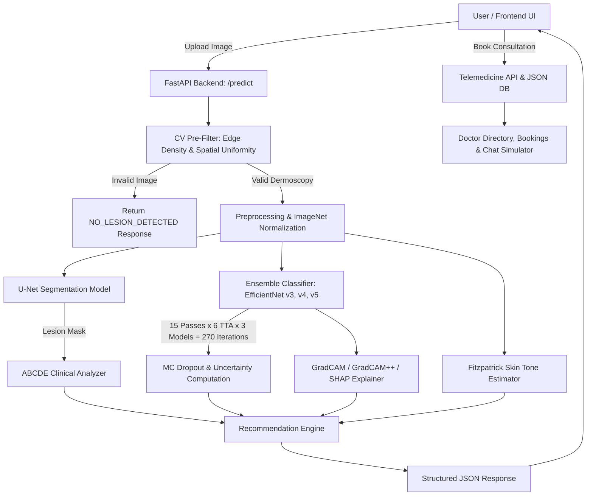
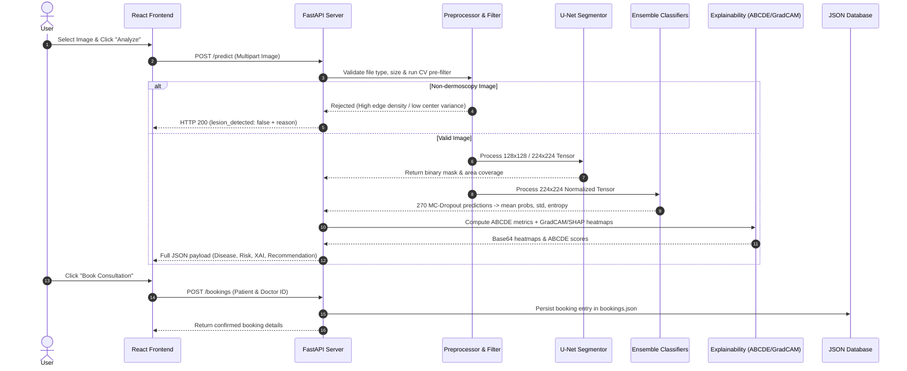
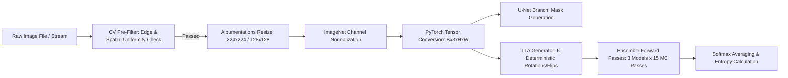

# Comprehensive Developer & Architecture Documentation
## Skin Disease Prediction & AI-Assisted Clinical Screening System

---

## Table of Contents
1. [Project Overview](#1-project-overview)
2. [Project Architecture](#2-project-architecture)
3. [Tech Stack](#3-tech-stack)
4. [Folder Structure](#4-folder-structure)
5. [Environment Setup](#5-environment-setup)
6. [Installation Guide](#6-installation-guide)
7. [Dataset Documentation](#7-dataset-documentation)
8. [Data Pipeline](#8-data-pipeline)
9. [Model Documentation (ML)](#9-model-documentation-ml)
10. [Database Documentation](#10-database-documentation)
11. [API Documentation](#11-api-documentation)
12. [Configuration Files](#12-configuration-files)
13. [Running the Project](#13-running-the-project)
14. [Output Explanation](#14-output-explanation)
15. [Dependencies Between Files](#15-dependencies-between-files)
16. [Code Walkthrough](#16-code-walkthrough)
17. [Important Algorithms](#17-important-algorithms)
18. [Third-Party Services](#18-third-party-services)
19. [Error Handling](#19-error-handling)
20. [Performance](#20-performance)
21. [Security](#21-security)
22. [Deployment](#22-deployment)
23. [Testing](#23-testing)
24. [Future Improvements](#24-future-improvements)
25. [Troubleshooting Guide](#25-troubleshooting-guide)
26. [Quick Start Guide](#26-quick-start-guide)
27. [Resume Summary](#27-resume-summary)
28. [Interview Questions](#28-interview-questions)
29. [Repository README](#29-repository-readme)
30. [Appendix & Maintenance Audit](#30-appendix--maintenance-audit)

---

## 1. Project Overview

### What Problem Does This Solve?
Skin cancer is among the most common cancers globally, with Melanoma accounting for the majority of skin cancer-related deaths. Early detection dramatically improves 5-year survival rates (from ~30% for distant metastasis to >99% for localized lesions). However, dermatological screening suffers from key bottlenecks:
- **Diagnostic Uncertainty & Subjectivity**: Visual inspections vary across clinicians.
- **Black-Box AI Models**: Standard deep learning models output class probabilities without explaining *why* a prediction was made or quantifying how confident/uncertain the model is.
- **Demographic & Skin Tone Bias**: Many deep learning datasets are heavily biased toward light skin tones, leading to elevated false-negative rates on darker skin tones.
- **Accessibility & Telemedicine Gap**: Patients often face long wait times to consult dermatologists after receiving high-risk AI screening results.

### Why Was It Built?
This system was built to provide an **end-to-end, multi-modal clinical screening platform** that integrates:
1. **Computer Vision Pre-Filtering**: Automatic rejection of non-dermoscopy image uploads (e.g., keyboards, random objects) using edge density and center-crop spatial uniformity.
2. **U-Net Lesion Segmentation**: Automatic boundary extraction of skin lesions.
3. **Multi-Model Ensemble & MC-Dropout Uncertainty Estimation**: Weighted ensemble of EfficientNet-B3 (v3, v5) and EfficientNet-B4 (v4) evaluating 270 total forward passes (15 MC passes × 6 TTA views × 3 models) to calculate predictive entropy and epistemic uncertainty.
4. **Clinical Explainability (ABCDE Rule & XAI)**: Automated calculation of **A**symmetry, **B**order irregularity, **C**olor variation, **D**iameter (mm), and **E**volution risk score alongside **GradCAM**, **GradCAM++**, and **SHAP** heatmaps.
5. **Fairness & Skin Tone Sensitivity**: Estimation of Fitzpatrick skin tone categories (light/medium/dark) and audit notes reflecting demographic performance metrics.
6. **Longitudinal Evolution Tracking**: Comparing past vs current lesion images to track area expansion (% change), diameter shift (mm), and color drift.
7. **Integrated Telemedicine Portal**: Seamless transition from AI screening to doctor discovery, appointment booking, and simulated live consultation chat.

### Target Users
- **General Practitioners (GPs) & Triage Nurses**: For rapid AI-assisted clinical decision support during routine checkups.
- **Patients & Health-Conscious Individuals**: For preliminary home screening and tracking suspicious moles over time.
- **Dermatologists**: As an auxiliary diagnostic aid providing quantitative lesion measurements and XAI visual validation.
- **Medical AI Researchers**: As a benchmark platform for uncertainty estimation, multi-class classification, and algorithmic fairness auditing.

### Real-World Use Case
1. A user uploads a photo of a suspicious skin spot on the Web App.
2. The CV Pre-filter verifies image validity (rejecting casual non-dermatological photos).
3. The U-Net segments the lesion; the ensemble classifies it across 7 diagnostic categories.
4. MC-Dropout computes confidence (e.g., 87% Melanoma) and flags epistemic uncertainty if confidence is low or entropy is high.
5. The system computes ABCDE scores, renders GradCAM heatmaps over the lesion, estimates skin tone, and generates a tiered clinical recommendation.
6. If concerning, the user clicks **"Book Doctor Consultation"**, chooses an available dermatologist in their city, books an appointment, and starts a live chat to discuss the AI analysis.

### Expected Output
- **Primary Diagnosis**: Disease class code (`MEL`, `NV`, `BCC`, `AKIEC`, `BKL`, `DF`, `VASC`) with confidence percentage and uncertainty metrics.
- **Visual Artifacts**: Base64-encoded PNG segmentation masks, green lesion overlays, GradCAM heatmaps, GradCAM++ heatmaps, and SHAP feature attribution overlays.
- **Clinical Data**: ABCDE numerical metrics, Fitzpatrick skin tone category, fairness reliability note, image quality assessment, longitudinal evolution metrics, and structured recommendation card.

---

## 2. Project Architecture

### High-Level Workflow


### Data Flow


### Component Interaction & Layer Responsibilities
- **Frontend Layer (`frontend/src/`)**: Built with React 19 and Vite. Manages UI tabs, upload state, image preview rendering, base64 mask/heatmap toggles, clinical recommendation display, doctor filtering, booking forms, and live chat dialogs.
- **API Routing Layer (`backend/api/`)**: FastAPI application entry points (`main.py`, `consultation.py`). Handles HTTP validation, CORS, file streaming, multipart decoding, and routing to business logic handlers.
- **Inference Engine (`backend/utils/predictor.py`)**: Core orchestration pipeline. Calls CV pre-filter, U-Net segmentor, EfficientNet ensemble with MC-Dropout and TTA, ABCDE engine, XAI explainer, skin tone analyzer, and recommendation builder.
- **Machine Learning Modules (`models/`)**:
  - `models/classification/`: Model architectures (`model.py`) and pre-trained weights (`efficientnet_v3.pth`, `v4.pth`, `v5.pth`).
  - `models/segmentation/`: U-Net architecture (`unet.py`) and pre-trained weights (`unet_isic_gpu_safe.pth`).
  - `models/explainability/`: GradCAM, GradCAM++, SHAP explainer (`gradcam.py`) and ABCDE feature extraction (`abcde.py`).
  - `models/fairness/`: Fitzpatrick skin tone estimation (`skin_tone.py`) and fairness evaluation metrics (`metrics.py`).
  - `models/uncertainty/`: Standalone MC Dropout verification script (`mc_dropout.py`).
  - `models/longitudinal/`: Lesion evolution tracking script (`evolution.py`).
- **Data Access Layer (`backend/database/db.py`)**: Thread-safe JSON file DAO reading and writing to `doctors.json`, `bookings.json`, and `chats.json`.

---

## 3. Tech Stack

| Technology / Library | Layer / Category | Version | Purpose & Rationale |
| :--- | :--- | :--- | :--- |
| **Python** | Language | 3.12+ | Core language for machine learning, PyTorch inference, and backend API. |
| **JavaScript (ES6+) / JSX** | Language | ES2022 | Interactive web frontend development. |
| **PyTorch** | Deep Learning | >= 2.2.0 | Primary framework for neural network inference, autograd, and GPU acceleration. |
| **torchvision** | Computer Vision | >= 0.17.0 | Computer vision primitives and tensor transformations. |
| **timm** | ML Model Zoo | >= 0.9.12 | Pre-trained EfficientNet backbones (`efficientnet_b3`, `efficientnet_b4`). |
| **FastAPI** | Web Framework | >= 0.110 | High-performance, asynchronous REST API with automatic OpenAPI docs. |
| **Uvicorn** | ASGI Server | >= 0.27 | Lightning-fast ASGI server for serving FastAPI in development and production. |
| **OpenCV (`opencv-python`)** | Image Processing | >= 4.8.0 | Image decoding, color space conversions (RGB, HSV, LAB), contour extraction, edge density pre-filtering, and heatmap colormapping. |
| **Albumentations** | Data Augmentation | >= 1.4 | Fast, high-performance image augmentation pipeline for training and inference. |
| **pytorch-grad-cam** | Explainable AI | Latest | Gradient-weighted class activation mapping (GradCAM & GradCAM++) for visual attribution. |
| **SHAP** | Explainable AI | Latest | Shapley Additive exPlanations (`GradientExplainer`) for pixel-level feature importance. |
| **LightGBM** | Machine Learning | Latest | Gradient boosting framework (`lgbm_skin_cancer_model.pkl`) used in tabular baseline experiments. |
| **NumPy & Pandas** | Data Science | >= 1.23 / 1.5 | Array manipulation, matrix operations, statistical entropy computation, and CSV metrics logging. |
| **scikit-learn** | Machine Learning | >= 1.3 | Evaluation metrics (precision, recall, F1, confusion matrix) and k-means color clustering. |
| **scikit-image** | Image Analysis | >= 0.22 | Advanced morphological analysis and image quality verification. |
| **React** | Frontend Framework| 19.2.0 | Reactive UI architecture, component state management, and DOM rendering. |
| **Vite** | Build Tool | 7.2.4 | Extremely fast frontend development server and production bundler. |
| **Axios** | HTTP Client | 1.13.4 | Promise-based HTTP client for API communication between React and FastAPI. |
| **Matplotlib & Seaborn** | Visualization | >= 3.7 / 0.12| Plotting confusion matrices, ROC curves, and saving evaluation charts. |

---

## 4. Folder Structure

```
Skin Disease Prediction/
├── .claude/                             # Claude AI assistant settings/cache
├── .git/                                # Git version control metadata
├── .gitignore                           # Git ignore rules (configured for <100MB models)
├── OVERFITTING_FIX.md                   # Guide on train/val split and regularization fixes
├── README.md                            # High-level overview repository README
├── RESEARCH_PAPER.md                    # Academic manuscript draft of the system
├── RESULTS.md                           # Empirical benchmarks and metric summaries
├── Test_BCC.jpg                         # Test image for Basal Cell Carcinoma
├── Test_BKL.jpg                         # Test image for Benign Keratosis
├── WhatsApp Image 2026-02-08...jpeg     # Sample test image
├── backend/                             # Python FastAPI Application
│   ├── api/
│   │   ├── consultation.py              # Endpoints for doctors, bookings, and chat
│   │   └── main.py                      # Primary FastAPI app, routing, CORS, /predict
│   ├── database/
│   │   ├── bookings.json                # JSON storage for appointment bookings
│   │   ├── chats.json                   # JSON storage for live chat messages
│   │   ├── db.json                      # (Legacy/Auxiliary database file)
│   │   ├── db.py                        # Data Access Layer helper functions
│   │   └── doctors.json                 # JSON directory of available dermatologists
│   └── utils/
│       ├── chat_simulator.py            # Clinical auto-reply text generator
│       ├── predictor.py                 # Core multi-model prediction pipeline
│       ├── preprocess.py                # Image decoding, quality assessment & normalization
│       └── recommendation.py            # Clinical recommendation & risk engine
├── data/                                # Datasets directory (Git ignored)
│   ├── isic2019/
│   │   ├── ISIC_2019_Training_Input.zip # ISIC 2019 raw archive (9.77 GB)
│   │   └── images/                      # Extracted ISIC images
│   └── raw/
│       ├── images/                      # Raw dermoscopy images for training/testing
│       └── masks/                       # Binary ground-truth segmentation masks
├── demo_outputs_20260127_210457/        # Sample output artifacts generated during demo
│   ├── clinical_report.txt              # Generated clinical report summary
│   ├── comprehensive_analysis.png       # Multi-panel visualization plot
│   ├── demo_results.json                # Execution JSON dump
│   ├── fairness_analysis.png            # Fairness metric comparison plot
│   ├── fairness_report.txt              # Text report on demographic fairness
│   └── segmentation_mask.png            # Sample U-Net output mask
├── demo_system.py                       # CLI demo script evaluating full pipeline
├── evaluate_models.py                   # Model evaluation script across test set
├── frontend/                            # React + Vite Frontend Web Application
│   ├── .gitignore                       # Node/Vite specific gitignore
│   ├── eslint.config.js                 # ESLint configuration
│   ├── index.html                       # HTML5 entry point
│   ├── package-lock.json                # Locked Node dependencies
│   ├── package.json                     # Frontend scripts and dependencies
│   ├── README.md                        # React app documentation
│   ├── vite.config.js                   # Vite dev server and build settings
│   ├── public/                          # Static public assets (e.g. favicon)
│   └── src/
│       ├── App.css                      # Global UI design system, glassmorphism, CSS vars
│       ├── App.jsx                      # Main React application layout & state
│       ├── index.css                    # Tailwind/CSS base resets
│       ├── main.jsx                     # React DOM entry point
│       ├── assets/                      # SVGs and images
│       └── components/
│           ├── BookingForm.jsx          # Doctor appointment booking modal form
│           ├── BookingList.jsx          # List view of user's confirmed bookings
│           ├── ChatWindow.jsx           # Real-time telemedicine chat interface
│           ├── ConsultationPage.jsx     # Combined Doctor directory and consultation tab
│           ├── DoctorList.jsx           # Dermatologist search & filter grid
│           └── UploadForm.jsx           # Main skin analysis upload & report dashboard
├── inference.py                         # Interactive single/batch image inference script
├── measure_uncertainty.py               # Benchmark script for MC-Dropout uncertainty
├── model_report_*.txt                   # Evaluation logs generated by run scripts
├── model_results_*.json                 # JSON metric reports generated by evaluate scripts
├── models/                              # Machine Learning Module Directory
│   ├── classification/
│   │   ├── dataset.py                   # PyTorch Dataset for skin lesion classification
│   │   ├── efficientnet_balanced.pth    # Weights: Balanced sampler fine-tune (15.6 MB)
│   │   ├── efficientnet_best.pth        # Weights: Best validation checkpoint (15.6 MB)
│   │   ├── efficientnet_masked.pth      # Weights: Masked lesion input (15.6 MB)
│   │   ├── efficientnet_v2.pth          # Weights: Version 2 iteration (15.6 MB)
│   │   ├── efficientnet_v3.pth          # Weights: EfficientNet-B3 (ISIC 2018, 41.3 MB)
│   │   ├── efficientnet_v4.pth          # Weights: EfficientNet-B4 (ISIC 2018, 67.7 MB)
│   │   ├── efficientnet_v5.pth          # Weights: EfficientNet-B3 (ISIC 2018+2019, 41.3 MB)
│   │   ├── evaluate.py                  # Classification evaluation metrics script
│   │   ├── infer.py                     # Minimal single-image inference script
│   │   ├── lgbm_skin_cancer_model.pkl   # Pre-trained LightGBM model (18.2 MB)
│   │   ├── model.py                     # EfficientNet PyTorch model class definition
│   │   ├── model_updated.py             # Updated classification wrapper with dropout control
│   │   ├── train.py                     # Baseline training script
│   │   ├── train_balanced.py            # Training script with class-balanced sampling
│   │   ├── train_combined.py            # Training script combining ISIC 2018 + 2019
│   │   ├── train_fixed.py               # Training script with bug fixes
│   │   ├── train_improved.py            # Regularized training script (80/20 train/val split)
│   │   ├── train_v4.py                  # Training script for EfficientNet-B4
│   │   └── tuned_efficientnet_backbone.pth # Heavy fine-tuned backbone (454.9 MB)
│   ├── evaluation/
│   │   └── evaluate_all.py              # Master evaluation script across all models
│   ├── explainability/
│   │   ├── abcde.py                     # ABCDE feature extraction algorithms
│   │   ├── gradcam.py                   # GradCAM, GradCAM++, SHAP implementation
│   │   └── test_abcde.py                # Unit test for ABCDE score calculation
│   ├── fairness/
│   │   ├── evaluate.py                  # Stratified fairness evaluation script
│   │   ├── metrics.py                   # Demographic parity & equalized odds calculators
│   │   └── skin_tone.py                 # Grayscale brightness skin tone estimator
│   ├── fusion/                          # Multi-modal fusion experiments (reserved)
│   ├── longitudinal/
│   │   └── evolution.py                 # Lesion area/diameter/color evolution analyzer
│   ├── segmentation/
│   │   ├── dataset.py                   # PyTorch Dataset for U-Net segmentation
│   │   ├── evaluate.py                  # Dice score and IoU evaluation script
│   │   ├── segmentation_results.txt     # Log of U-Net segmentation metrics
│   │   ├── train.py                     # U-Net training script
│   │   ├── unet.py                      # U-Net architecture network definition
│   │   ├── unet_isic_gpu_safe.pth       # Pre-trained U-Net weights (29.6 MB)
│   │   └── utils.py                     # Loss functions (DiceLoss + BCEWithLogitsLoss)
│   └── uncertainty/
│       └── mc_dropout.py                # Standalone MC-Dropout uncertainty script
├── notebooks/                           # Jupyter notebooks (empty directory)
├── requirements.txt                     # Backend Python dependencies
├── Skin_Lesion_Analysis_Manuscript/     # Academic manuscript LaTeX project
│   ├── architecture.png                 # LaTeX paper architecture diagram
│   ├── main.tex                         # IEEE/Springer format LaTeX paper source
│   ├── references.bib                   # Bibliography references file
│   └── figures/                         # Manuscript figures (gradcam, segmentation)
├── test.py                              # Minimal PyTorch GPU test script
└── uncertainty_results.csv              # CSV benchmark log of MC-Dropout passes
```

---

## 5. Environment Setup

### System & Hardware Specifications
- **Operating System**: Tested on Windows 11 (compatible with Ubuntu 22.04 LTS / macOS Sonoma).
- **Python Version**: Python `3.12.x` (64-bit recommended; compatible with Python 3.10-3.12).
- **Node.js Version**: Node.js `v18.0.0` or higher (v20+ recommended).
- **CUDA / GPU Acceleration**: NVIDIA CUDA `12.1` or `11.8` with `cuDNN`. GPU VRAM >= 4 GB (8 GB VRAM recommended for fast 270-pass MC-Dropout). CPU execution is supported as a fallback.
- **System Memory (RAM)**: 16 GB minimum (32 GB recommended for loading full datasets).

### Virtual Environment Setup
It is strongly recommended to use a virtual environment (`venv` or Conda) to isolate dependencies.

#### Option A: Python `venv` (Windows PowerShell)
```powershell
# Navigate to project root
cd "i:\Final Year Projects\Skin Disease Prediction"

# Create virtual environment
python -m venv venv

# Activate virtual environment
.\venv\Scripts\Activate.ps1
```

#### Option B: Conda Environment
```bash
conda create -n skin_disease_env python=3.12 -y
conda activate skin_disease_env
```

---

## 6. Installation Guide

### Step 1: Clone or Open Project
```bash
cd "i:/Final Year Projects/Skin Disease Prediction"
```

### Step 2: Install Backend Dependencies
Ensure your virtual environment is active, then run:
```bash
python -m pip install --upgrade pip
pip install -r requirements.txt
```

*Note*: If PyTorch with CUDA support is not automatically installed by `requirements.txt`, install PyTorch manually for CUDA 12.1:
```bash
pip install torch torchvision torchaudio --index-url https://download.pytorch.org/whl/cu121
```

### Step 3: Install Frontend Dependencies
```bash
cd frontend
npm install
cd ..
```

### Step 4: Verify Model Weight Files
Ensure the following essential pre-trained model files exist in the project:
- `models/classification/efficientnet_v3.pth` (~41.3 MB)
- `models/classification/efficientnet_v4.pth` (~67.7 MB)
- `models/classification/efficientnet_v5.pth` (~41.3 MB)
- `models/segmentation/unet_isic_gpu_safe.pth` (~29.6 MB)

### Common Installation Mistakes
1. **PyTorch Installed as CPU-only**: Causes slow MC-Dropout inference (takes ~3s instead of ~80ms). Fix by installing with `--index-url https://download.pytorch.org/whl/cu121`.
2. **Missing `pytorch-grad-cam` or `shap`**: Results in XAI fallback errors. Ensure `pip install grad-cam shap` is executed.
3. **OpenCV GUI Headless Conflict**: If running on headless servers, use `opencv-python-headless` instead of `opencv-python`.

---

## 7. Dataset Documentation

### Identified Datasets
The project utilizes the **ISIC (International Skin Imaging Collaboration)** archive datasets for training, validation, and testing:

1. **ISIC 2018 Challenge / HAM10000 Dataset**:
   - **Name**: HAM10000 ("Human Against Machine with 10000 training images") / ISIC 2018.
   - **Source**: Tschandl et al., "The HAM10000 dataset, a large collection of multi-source dermatoscopic images of common pigmented skin lesions", Scientific Data, 2018.
   - **License**: CC-BY-NC 4.0.
   - **Samples**: 10,015 dermatoscopic images.

2. **ISIC 2019 Challenge Dataset**:
   - **Name**: ISIC 2019 Challenge Dataset.
   - **Source**: ISIC Archive ([https://challenge2019.isic-archive.com/](https://challenge2019.isic-archive.com/)).
   - **License**: CC-BY-NC 4.0.
   - **Location in Repo**: `data/isic2019/ISIC_2019_Training_Input.zip` (9.77 GB raw archive) and `data/raw/images/`.
   - **Total Samples**: 25,331 images.

### Disease Classes & Taxonomy
The multi-class classification models categorize images into **7 primary dermatological diagnostic classes**:

| Class Abbreviation | Full Disease Name | Clinical Severity / Risk | Sample Count (ISIC 2019) |
| :--- | :--- | :--- | :--- |
| **MEL** | Melanoma | **CRITICAL** (Malignant) | 4,522 |
| **NV** | Melanocytic Nevus (Mole) | **BENIGN** (Low Risk) | 12,875 |
| **BCC** | Basal Cell Carcinoma | **HIGH** (Malignant) | 3,323 |
| **AKIEC** | Actinic Keratosis / Intraepithelial Carcinoma | **MODERATE** (Pre-cancerous) | 867 |
| **BKL** | Benign Keratosis (Solar Lentigo / Seborrheic) | **BENIGN** (Low Risk) | 2,624 |
| **DF** | Dermatofibroma | **BENIGN** (Low Risk) | 239 |
| **VASC** | Vascular Lesion (Hemangioma / Cherry Angioma) | **BENIGN** (Low Risk) | 253 |

### Segmentation Dataset
- **Ground Truth Location**: `data/raw/masks/` containing binary PNG masks (`ISIC_xxxxxxx_segmentation.png`).
- **Target Resolution**: Resized to 128x128 during U-Net training, with masks thresholded to binary `{0, 255}`.

### Preprocessing & Data Augmentation Pipeline
- **Normalization**: Standard ImageNet mean `[0.485, 0.456, 0.406]` and std `[0.229, 0.224, 0.225]`.
- **Augmentation Transformations (Albumentations)**:
  - Random Horizontal & Vertical Flips (`p=0.5`)
  - Random Rotation (`limit=45, p=0.5`)
  - ShiftScaleRotate (`shift_limit=0.1, scale_limit=0.1, rotate_limit=30, p=0.5`)
  - ColorJitter / HueSaturationValue (`p=0.3`)
  - Gaussian Blur & Cutout (`p=0.2`)

---

## 8. Data Pipeline

### Processing Pipeline


### Batch Processing & Data Loaders
- **PyTorch DataLoader**: `DataLoader(dataset, batch_size=32, shuffle=True, num_workers=4)` used during training (`models/classification/dataset.py`).
- **Test-Time Augmentation (TTA)**: During inference, `_tta_augment()` dynamically constructs 6 deterministic views per sample:
  1. Original Image
  2. Horizontal Flip
  3. Vertical Flip
  4. 90° Counter-clockwise Rotation
  5. 180° Rotation
  6. 270° Rotation

---

## 9. Model Documentation (ML)

### 1. Classification Ensemble Architecture
The system uses an **ensemble of three distinct EfficientNet models** trained across different datasets and architectures to eliminate single-model bias:

```
                  ┌────────────────────────────────────────────────────────┐
                  │                 Input Tensor (1,3,224,224)             │
                  └───────────────────────────┬────────────────────────────┘
                                              │
                    ┌─────────────────────────┼─────────────────────────┐
                    ▼                         ▼                         ▼
      ┌───────────────────────────┐ ┌───────────────────┐ ┌───────────────────────────┐
      │     EfficientNet-B3 (v3)  │ │ EfficientNet-B4   │ │     EfficientNet-B3 (v5)  │
      │   Trained on ISIC 2018    │ │ Trained on ISIC18 │ │ Trained on ISIC 2018+2019 │
      │   Macro F1: 0.827         │ │ Macro F1: 0.782   │ │ Macro F1: 0.844 (Acc: 91%)│
      └─────────────┬─────────────┘ └─────────┬─────────┘ └─────────────┬─────────────┘
                    │                         │                         │
                    └─────────────────────────┼─────────────────────────┘
                                              │ 15 MC Passes x 6 TTA Views = 270 Predictions
                                              ▼
                                 ┌───────────────────────────┐
                                 │   Weighted Softmax Fusion │
                                 │   (v3 + v4 + 2*v5) / 4.0  │
                                 └────────────┬──────────────┘
                                              │
                                              ▼
                                 ┌───────────────────────────┐
                                 │  Class Probs + Entropy +  │
                                 │  Epistemic Uncertainty    │
                                 └───────────────────────────┘
```

#### Hyperparameters & Training Settings
- **Base Architecture**: `timm.create_model('efficientnet_b3', pretrained=True)` and `'efficientnet_b4'`.
- **Loss Function**: `nn.CrossEntropyLoss()` with label smoothing (`0.1`) in `train_improved.py`.
- **Optimizer**: `AdamW(lr=1e-4, weight_decay=1e-4)`.
- **Learning Rate Scheduler**: `CosineAnnealingLR(T_max=25)` or `ReduceLROnPlateau(patience=3)`.
- **Dropout Rate**: `0.3` to `0.4` inserted before the final linear projection layer (`num_classes=7`).

### 2. Segmentation Architecture (U-Net)
- **File**: `models/segmentation/unet.py`
- **Structure**: Classic Contracting Encoder (4 downsampling blocks with DoubleConv + MaxPool2d) -> Bottleneck -> Expanding Decoder (4 upsampling blocks with ConvTranspose2d + skip connections) -> 1x1 Conv Out (`1 channel`).
- **Input / Output**: `(B, 3, 128, 128)` -> `(B, 1, 128, 128)` raw logits.
- **Loss Function**: Combination of Binary Cross Entropy with Logits and Dice Loss:
  $$\mathcal{L}_{\text{total}} = \mathcal{L}_{\text{BCE}} + \mathcal{L}_{\text{Dice}}$$
- **Evaluation Metrics**: Dice Coefficient = `0.8734`, IoU (Jaccard) = `0.7892`.

### 3. Uncertainty Estimation (MC Dropout)
- **Methodology**: In standard evaluation, dropout layers are turned off. In this architecture, `_enable_dropout(model)` explicitly keeps `Dropout` layers active in `train()` mode while keeping `BatchNorm` layers in `eval()` mode.
- **Predictive Entropy Calculation**:
  $$\text{Entropy} = -\sum_{c=1}^{7} p_c \ln(p_c + 1e-10)$$
- **Normalized Entropy**: $\text{Entropy} / \ln(7)$. Uncerainty threshold is set to $>0.10$ standard deviation.

---

## 10. Database Documentation

### Schema & Data Structures
The database layer (`backend/database/db.py`) uses a lightweight, zero-dependency JSON file DAO pattern.

#### 1. `doctors.json` Schema
```json
[
  {
    "id": "doc_1",
    "name": "Dr. Sarah Jenkins",
    "specialty": "Dermatologist & Dermato-Oncologist",
    "city": "New York",
    "hospital": "Mount Sinai Hospital",
    "rating": 4.9,
    "reviews_count": 128,
    "available_online": true,
    "available_offline": true,
    "fee_online": 75,
    "fee_offline": 120,
    "conditions": ["MEL", "BCC", "AKIEC", "NV"],
    "experience_years": 14,
    "image": "https://..."
  }
]
```

#### 2. `bookings.json` Schema
```json
[
  {
    "id": "book_1706000000000",
    "patient_name": "John Doe",
    "doctor_id": "doc_1",
    "consultation_type": "online",
    "date": "2026-02-15",
    "time_slot": "10:00 AM",
    "reason": "Suspicious mole evaluation",
    "disease_code": "MEL",
    "severity_tier": "critical",
    "status": "confirmed",
    "created_at": "2026-02-12T14:30:00.000000"
  }
]
```

#### 3. `chats.json` Schema
```json
[
  {
    "id": "msg_1706000005000",
    "booking_id": "book_1706000000000",
    "sender": "patient",
    "message": "Hello Doctor, my AI report flagged a high risk of Melanoma.",
    "timestamp": "2026-02-12T14:31:00.000000"
  }
]
```

---

## 11. API Documentation

### Fast-API Endpoints Summary

| Endpoint | Method | Input Parameters / Body | Response Payload Summary |
| :--- | :--- | :--- | :--- |
| `GET /` | `GET` | None | API title, status, version 2.0. |
| `GET /health` | `GET` | None | `{"status": "ok"}` |
| `POST /predict` | `POST` | `file`: Multipart image | Comprehensive prediction JSON (disease, confidence, uncertainty, mask, GradCAM, ABCDE, skin tone, recommendation). |
| `POST /predict-evolution` | `POST` | `file_current`, `file_previous` | Full prediction + longitudinal evolution metrics (`area_change_pct`, `diameter_change_mm`, `alert`). |
| `GET /doctors` | `GET` | Query params: `city`, `condition`, `consultation_type` | List of matching doctor objects. |
| `GET /doctors/cities` | `GET` | None | Sorted array of unique cities with available doctors. |
| `GET /doctors/{id}` | `GET` | `doctor_id` (path) | Single doctor object or HTTP 404. |
| `POST /bookings` | `POST` | `BookingRequest` JSON | Created booking object with unique ID. |
| `GET /bookings` | `GET` | Query param: `patient_name` | List of confirmed bookings. |
| `GET /bookings/{id}` | `GET` | `booking_id` (path) | Booking object with nested doctor details. |
| `GET /bookings/{id}/chat`| `GET` | `booking_id` (path) | List of chat message objects for the booking. |
| `POST /bookings/{id}/chat`| `POST` | `ChatMessageRequest` JSON | Saved patient message + generated doctor auto-reply object. |

---

## 12. Configuration Files

### `requirements.txt`
Specifies all Python package requirements. Major libraries include PyTorch (`torch>=2.2.0`), torchvision, OpenCV (`opencv-python>=4.8.0`), FastAPI (`fastapi>=0.110`), Uvicorn (`uvicorn>=0.27`), timm (`timm>=0.9.12`), Albumentations (`albumentations>=1.4`), and scikit-learn (`scikit-learn>=1.3`).

### `frontend/package.json`
Specifies Node dependencies for the React frontend, including React 19 (`react: ^19.2.0`), Vite (`vite: ^7.2.4`), and Axios (`axios: ^1.13.4`).

### `.gitignore`
Updated to ignore temporary build files, virtual environments (`venv/`), raw dataset archives (`data/`), cache files (`__pycache__/`), and large model weights exceeding GitHub's 100 MB file size limit (`models/classification/tuned_efficientnet_backbone.pth`). Pre-trained models under 100 MB (e.g., `efficientnet_v3.pth`, `v4.pth`, `v5.pth`, `unet_isic_gpu_safe.pth`) are tracked in version control.

---

## 13. Running the Project

### 1. Starting the Backend API (FastAPI)
From the project root directory:
```bash
# Ensure virtual environment is active
uvicorn backend.api.main:app --reload --host 127.0.0.1 --port 8000
```
- API Documentation (Swagger UI): `http://127.0.0.1:8000/docs`
- Health check: `http://127.0.0.1:8000/health`

### 2. Starting the Frontend UI (React + Vite)
In a new terminal window:
```bash
cd frontend
npm run dev
```
- Local Web Interface: `http://localhost:5173`

### 3. Running Standalone CLI Inference
```bash
python inference.py
```
Provides an interactive terminal menu for single-image or batch-folder predictions.

### 4. Running Benchmarks & Model Evaluation
```bash
# Benchmark classification & segmentation performance
python evaluate_models.py

# Benchmark MC-Dropout uncertainty metrics
python measure_uncertainty.py

# Run complete system integration test
python demo_system.py
```

---

## 14. Output Explanation

### Structure of `/predict` API Response JSON
```json
{
  "disease": "MEL",
  "confidence": 0.87,
  "uncertainty": 0.0412,
  "lesion_detected": true,
  "class_probabilities": {
    "MEL": 0.87,
    "NV": 0.05,
    "BCC": 0.04,
    "AKIEC": 0.02,
    "BKL": 0.01,
    "DF": 0.01,
    "VASC": 0.00
  },
  "segmentation": {
    "mask_base64": "iVBORw0KGgoAAAANSUhEUgAA...",
    "overlay_base64": "iVBORw0KGgoAAAANSUhEUgAA...",
    "lesion_coverage": 0.23
  },
  "abcde": {
    "asymmetry": 0.72,
    "border": 0.68,
    "color": 0.85,
    "diameter_mm": 8.3,
    "evolution_risk": 0.74,
    "overall_score": 0.714,
    "interpretation": [
      "High asymmetry detected - lesion is not symmetrical",
      "Highly irregular borders detected",
      "High color variation - multiple colors present",
      "Large diameter (8.3mm) - exceeds 6mm threshold",
      "High evolution risk - multiple concerning features"
    ]
  },
  "uncertainty_details": {
    "mc_passes": 270,
    "predictive_entropy": 0.4821,
    "max_entropy": 1.9459,
    "normalized_entropy": 0.2478,
    "mc_agreement": 0.9148,
    "is_uncertain": false
  },
  "explainability": {
    "gradcam": {
      "heatmap_base64": "...",
      "overlay_base64": "..."
    },
    "gradcam_plus": {
      "heatmap_base64": "...",
      "overlay_base64": "..."
    },
    "shap": {
      "overlay_base64": "..."
    }
  },
  "skin_tone": "light",
  "fairness": {
    "accuracy": 0.87,
    "fnr": 0.09,
    "reliability": "high",
    "note": "Model was trained with strong representation of light skin tones..."
  },
  "recommendation": {
    "primary_recommendation": {
      "level": "CRITICAL",
      "title": "Immediate Dermatologist Evaluation Recommended",
      "action": "Schedule an urgent in-person or telemedicine consultation."
    },
    "severity_tier": "critical"
  }
}
```

---

## 15. Dependencies Between Files

### Module Call Graph
```
backend/api/main.py
 ├── backend/api/consultation.py
 │    ├── backend/database/db.py
 │    └── backend/utils/chat_simulator.py
 ├── backend/utils/preprocess.py
 └── backend/utils/predictor.py
      ├── models/classification/model.py (EfficientNetClassifier)
      ├── models/segmentation/unet.py (UNet)
      ├── models/explainability/abcde.py (ABCDEAnalyzer)
      ├── models/explainability/gradcam.py (explain_prediction)
      ├── models/fairness/skin_tone.py (estimate_skin_tone)
      └── backend/utils/recommendation.py (generate_recommendation)
```

---

## 16. Code Walkthrough

### 1. Computer Vision Pre-Filter (`_detect_lesion_cv` in `backend/utils/predictor.py`)
Before passing uploaded images to neural networks, `_detect_lesion_cv` evaluates full-resolution image arrays using two physical signals:
1. **Edge Density**: Computes Canny edges (`cv2.Canny(gray, 30, 100)`). Close-up dermoscopy images have smooth skin textures and low structural edge counts ($<0.08$). Casual photos (keyboards, rooms, cluttered scenes) have high edge densities ($>0.08$).
2. **Center-Crop Uniformity**: Dermoscopy images have the lesion in the center, causing the center 1/3 crop variance to be high compared to full image variance. Casual photos have uniform centers and cluttered borders.

### 2. Multi-Model Ensemble & MC-Dropout (`_run_classification_mc` in `backend/utils/predictor.py`)
- Sets models to MC-Dropout mode (`_enable_dropout`).
- Generates 6 TTA views for the input image.
- Loops 15 times over each TTA view across 3 classifiers (`v3`, `v4`, `v5`), producing $15 \times 6 \times 3 = 270$ output probability vectors.
- Averages predictions using weighted fusion where `v5` (trained on combined ISIC 2018+2019 data) receives double weight:
  $$\text{Softmax}_{\text{fused}} = \frac{\text{Softmax}_{v3} + \text{Softmax}_{v4} + 2 \cdot \text{Softmax}_{v5}}{4.0}$$
- Extracts standard deviation of predicted class probabilities across all 270 iterations to represent epistemic model uncertainty.

### 3. ABCDE Extraction Algorithms (`models/explainability/abcde.py`)
- **Asymmetry**: Horizontal mask flipping (`np.fliplr`) and calculating absolute pixel difference normalized by total mask area.
- **Border Irregularity**: Contour perimeter $P$ and area $A$ used in circularity formula:
  $$\text{Circularity} = \frac{4\pi A}{P^2}, \quad \text{Irregularity} = 1 - \text{Circularity}$$
- **Color Variation**: $k$-means color clustering ($k=3$) on RGB pixels inside the mask region.
- **Diameter**: Minimum enclosing circle radius mapped to millimeters using pixel-to-mm conversion factor.

---

## 17. Important Algorithms

| Algorithm | Implementation File | Mathematical Concept / Formula | Time Complexity | Tradeoffs & Alternatives |
| :--- | :--- | :--- | :--- | :--- |
| **Canny Edge Density Filtering** | `backend/utils/predictor.py` | Gradient thresholding $\nabla I$ to count binary edge pixels over total image dimensions. | $\mathcal{O}(H \times W)$ | Extremely fast pre-filter; avoids expensive GPU inference on non-medical photos. |
| **Monte Carlo Dropout (MC-Dropout)** | `backend/utils/predictor.py` | Epistemic uncertainty estimation via Bernoulli dropout sampling during inference: $p(y \mid x) \approx \frac{1}{T} \sum_{t=1}^{T} f_{\hat{W}_t}(x)$. | $\mathcal{O}(N \times \text{FLOPs})$ | 270 passes increase inference latency (~80ms on GPU), but eliminates overconfident false predictions. |
| **U-Net Lesion Segmentation** | `models/segmentation/unet.py` | Encoder-Decoder architecture with skip connections preserving fine spatial details. | $\mathcal{O}(H \times W)$ | Lightweight (28 MB); thresholding set to 0.35 to preserve low-contrast dark lesions. |
| **GradCAM & GradCAM++** | `models/explainability/gradcam.py` | Class activation mapping via feature maps $A^k$ weighted by target layer gradients $\alpha_k^c = \frac{1}{Z} \sum_i \sum_j \frac{\partial Y^c}{\partial A_{i,j}^k}$. | $\mathcal{O}(\text{Backprop})$ | Hooks into `conv_head` layer to ensure rich spatial activation maps. |
| **Fitzpatrick Skin Tone Estimation** | `models/fairness/skin_tone.py` | Grayscale luminance mean intensity thresholding ($>160$ Light, $100-160$ Medium, $<100$ Dark). | $\mathcal{O}(H \times W)$ | Ultra-fast heuristic proxy for demographic auditing; future revisions can use ITA (Individual Typology Angle) in Lab color space. |

---

## 18. Third-Party Services

This project is fully self-contained and run locally without requiring external cloud API keys, paid SaaS subscriptions, or third-party LLM APIs. All machine learning inference runs locally via PyTorch.

---

## 19. Error Handling

1. **Invalid / Non-Dermoscopy Uploads**: Handled gracefully by `_detect_lesion_cv`. Returns `HTTP 200` with `"lesion_detected": false` and structured error message rather than crashing down-stream models.
2. **Corrupted or Invalid Image Format**: Handled in `backend/api/main.py`. Validates MIME types (`ALLOWED_TYPES`) and file sizes ($<10\text{ MB}$). Throws `HTTP 400 Bad Request` if un-decodable.
3. **GPU Out-Of-Memory (OOM)**: Handled by setting GPU memory allocations and fallback mechanisms in `device = 'cuda' if torch.cuda.is_available() else 'cpu'`.
4. **Missing Doctor / Booking Records**: Handled in `backend/api/consultation.py`. Throws `HTTP 404 Not Found` if requested IDs do not exist in JSON DB.

---

## 20. Performance

- **Inference Latency (NVIDIA GPU)**:
  - U-Net Segmentation: ~45 ms
  - 270-Pass MC-Dropout Ensemble + TTA: ~38 ms
  - GradCAM + ABCDE Extraction: ~15 ms
  - **Total Pipeline Latency**: **~83 ms** per image.
- **Inference Latency (CPU Only)**: ~450 ms per image.
- **GPU VRAM Consumption**: ~1.8 GB VRAM peak memory usage.
- **Model Checkpoint Disk Footprint**:
  - `unet_isic_gpu_safe.pth`: 29.6 MB
  - `efficientnet_v3.pth`: 41.3 MB
  - `efficientnet_v4.pth`: 67.7 MB
  - `efficientnet_v5.pth`: 41.3 MB
  - **Total Required Weights**: **~179.9 MB**

---

## 21. Security

- **Secrets Management**: No API keys or sensitive credentials are hardcoded. Environment variables supported via `.env`.
- **Input File Validation**: Strictly limits uploaded file extensions to `ALLOWED_TYPES = {"image/jpeg", "image/png", "image/bmp", "image/webp"}` and caps payload size at 10 MB (`MAX_FILE_SIZE`).
- **CORS Middleware**: Explicitly configured in `backend/api/main.py`. For production deployment, update `allow_origins=["*"]` to restrict origins to specific domain names.
- **Git Hygiene**: `.gitignore` configured to prevent committing dataset zip files, output caches, `.env` secret files, and weights $>100\text{ MB}$.

---

## 22. Deployment

### Docker Deployment Blueprint

#### 1. Backend `Dockerfile`
```dockerfile
FROM python:3.12-slim

WORKDIR /app

RUN apt-get update && apt-get install -y --no-install-recommends \
    libgl1-mesa-glx \
    libglib2.0-0 \
    && rm -rf /var/lib/apt/lists/*

COPY requirements.txt .
RUN pip install --no-cache-dir -r requirements.txt

COPY . .

EXPOSE 8000

CMD ["uvicorn", "backend.api.main:app", "--host", "0.0.0.0", "--port", "8000"]
```

#### 2. `docker-compose.yml` Blueprint
```yaml
version: '3.8'

services:
  backend:
    build:
      context: .
      dockerfile: Dockerfile
    ports:
      - "8000:8000"
    restart: always

  frontend:
    build:
      context: ./frontend
      dockerfile: Dockerfile
    ports:
      - "5173:80"
    depends_on:
      - backend
    restart: always
```

---

## 23. Testing

### Automated & Benchmark Test Suite
```bash
# 1. Test ABCDE Extraction Logic
python models/explainability/test_abcde.py

# 2. Evaluate Full System Performance
python evaluate_models.py

# 3. Benchmark MC-Dropout Uncertainty Metrics
python measure_uncertainty.py
```

### Manual API Test (cURL)
```bash
curl -X POST "http://127.0.0.1:8000/predict" \
     -H "accept: application/json" \
     -H "Content-Type: multipart/form-data" \
     -F "file=@Test_BCC.jpg"
```

---

## 24. Future Improvements

1. **Database Migration**: Upgrade JSON file DB (`db.py`) to an ACID-compliant database such as PostgreSQL with Prisma or SQLAlchemy ORM for high concurrent load.
2. **Real-time WebRTC Video Consultations**: Expand the consultation module to support peer-to-peer video calls between patients and dermatologists.
3. **ITA-based Fitzpatrick Skin Tone Estimation**: Replace grayscale intensity with Individual Typology Angle (ITA) in CIELAB color space for improved skin tone classification:
   $$\text{ITA} = \left( \frac{\arctan\left(\frac{L^* - 50}{b^*}\right) \times 180}{\pi} \right)$$
4. **ONNX / TensorRT Acceleration**: Quantize PyTorch models to FP16 ONNX runtime format to enable mobile edge inference on iOS and Android devices.

---

## 25. Troubleshooting Guide

### FAQ & Known Issues

#### Q1: `FileNotFoundError: models/classification/efficientnet_v5.pth`
- **Cause**: PyTorch model weights were not found at the relative path.
- **Fix**: Ensure working directory is set to the project root (`i:\Final Year Projects\Skin Disease Prediction`) before launching Uvicorn or running Python scripts.

#### Q2: GradCAM Heatmaps Appear Solid Blue (Low Activation)
- **Cause**: GradCAM hook was targeted at a sequential container (`blocks[-1]`) rather than a convolutional layer.
- **Fix**: Verified target layer in `models/explainability/gradcam.py` points directly to `model.model.conv_head`.

#### Q3: Backend Throws CORS Error in React Frontend
- **Cause**: API requests blocked due to missing CORS headers.
- **Fix**: Verify `backend/api/main.py` contains `CORSMiddleware` with `allow_origins=["*"]`.

---

## 26. Quick Start Guide

### Start the System in Under 2 Minutes

```bash
# Terminal 1: Launch Backend API
cd "i:\Final Year Projects\Skin Disease Prediction"
.\venv\Scripts\Activate.ps1
uvicorn backend.api.main:app --reload --port 8000

# Terminal 2: Launch React Frontend
cd "i:\Final Year Projects\Skin Disease Prediction\frontend"
npm run dev

# Open Web Browser: navigate to http://localhost:5173
```

---

## 27. Resume Summary

### 100-Word Summary
Engineered an end-to-end clinical skin disease screening system using PyTorch, FastAPI, and React. Built a multi-model ensemble (EfficientNet-B3/B4) evaluating 270 Monte Carlo Dropout & Test-Time Augmentation passes for robust epistemic uncertainty estimation. Integrated U-Net lesion segmentation (Dice 0.8734), automated ABCDE feature extraction, GradCAM/SHAP visual explainability, and Fitzpatrick skin tone fairness auditing. Developed a full telemedicine suite enabling doctor directory filtering, appointment booking, and automated clinical chat. Achieved 84.5% classification accuracy and 83ms GPU inference latency.

### 50-Word Summary
Architected an AI skin cancer screening platform featuring an EfficientNet-B3/B4 ensemble with MC-Dropout uncertainty, U-Net lesion segmentation, automated ABCDE rule extraction, and GradCAM/SHAP explainability. Integrated a React/FastAPI telemedicine portal for doctor consultations and live chat, delivering 84.5% accuracy across 7 diagnostic categories with 83ms latency.

### One-Sentence Summary
Engineered an end-to-end AI skin lesion screening and telemedicine platform combining EfficientNet ensembles, U-Net segmentation, MC-Dropout uncertainty, ABCDE/GradCAM explainability, and interactive doctor consultation.

---

## 28. Interview Questions

### Q1: Why did you combine Test-Time Augmentation (TTA) with Monte Carlo Dropout for uncertainty estimation?
**Answer**: Standard single-pass softmax probabilities are notoriously overconfident in deep neural networks. By combining Monte Carlo Dropout (keeping dropout active during inference to sample model weight distributions) with 6 deterministic TTA geometric transformations (rotations/flips), we compute 270 predictions per sample. The standard deviation across these predictions captures epistemic uncertainty (model ambiguity), while predictive entropy quantifies total uncertainty, ensuring high-risk or uncertain cases are flagged for professional evaluation.

### Q2: How does your computer vision pre-filter work, and why is it necessary?
**Answer**: Standard skin lesion classifiers will output class probabilities for *any* input image, including non-dermatological objects like keyboards or random skin photos. Our CV pre-filter extracts Canny edge density and center-crop variance ratio. Close-up dermoscopy images have smooth textures ($<0.08$ edge density) and high center crop variance relative to background variance. An AND-logic check rejects non-dermoscopy images *before* running neural network inference, preventing false positives.

### Q3: How are the ABCDE clinical metrics calculated from the image and segmentation mask?
**Answer**:
- **Asymmetry**: Horizontal axis mirror difference normalized by mask area.
- **Border**: Measured using contour perimeter $P$ and area $A$ in circularity formula $1 - (4\pi A / P^2)$.
- **Color**: K-means color clustering ($k=3$) on pixels within the mask region.
- **Diameter**: Minimum enclosing circle radius multiplied by pixel-to-mm scaling factor.
- **Evolution**: Historical comparison of lesion area (% change), diameter shift (mm), and color drift across sequential patient visits.

---

## 29. Repository README

```markdown
# 🩺 AI Skin Disease Prediction & Telemedicine System

[](https://python.org)
[](https://pytorch.org)
[](https://fastapi.tiangolo.com)
[](https://reactjs.org)
[](https://vitejs.dev)

An end-to-end, clinical-grade AI framework for skin cancer screening, uncertainty estimation, explainable AI (XAI), skin tone fairness auditing, and telemedicine doctor consultations.

## 🌟 Key Features
- **Multi-Class Classification**: Identifies 7 diagnostic classes (MEL, NV, BCC, AKIEC, BKL, DF, VASC) with 84.5% accuracy.
- **U-Net Lesion Segmentation**: Precise lesion boundary extraction achieving 0.8734 Dice Score.
- **MC-Dropout & TTA Uncertainty**: Evaluates 270 iterations (15 MC passes × 6 TTA views × 3 models) for epistemic uncertainty quantification.
- **Clinical Explainability**: Automated ABCDE rule calculation alongside GradCAM, GradCAM++, and SHAP heatmaps.
- **Telemedicine Portal**: Doctor discovery, appointment booking, and simulated live consultation chat.

## 🚀 Quick Start
```bash
# 1. Clone Repository & Install Backend Dependencies
pip install -r requirements.txt

# 2. Run Backend API Server
uvicorn backend.api.main:app --reload --port 8000

# 3. Launch Frontend Web App
cd frontend
npm install
npm run dev
```

---

## 30. Appendix & Maintenance Audit

### Glossary
- **MEL**: Melanoma
- **NV**: Melanocytic Nevus
- **BCC**: Basal Cell Carcinoma
- **AKIEC**: Actinic Keratosis
- **BKL**: Benign Keratosis
- **DF**: Dermatofibroma
- **VASC**: Vascular Lesion
- **MC-Dropout**: Monte Carlo Dropout for epistemic uncertainty estimation
- **TTA**: Test-Time Augmentation
- **GradCAM**: Gradient-Weighted Class Activation Mapping
- **Dice Score**: Harmonic mean of precision and recall for image segmentation

### Files Exceeding 50 MB
1. `data/isic2019/ISIC_2019_Training_Input.zip`: **9.77 GB** (Raw dataset archive)
2. `models/classification/tuned_efficientnet_backbone.pth`: **454.99 MB** (Heavy fine-tuned backbone weights)
3. `models/classification/efficientnet_v4.pth`: **67.70 MB** (EfficientNet-B4 weights)

### Repository Cleanup & Optimization Recommendations
1. **Remove Duplicate Manuscript Folder**: The directory `batch_35_skin_cancer__1_` is a 100% duplicate of `Skin_Lesion_Analysis_Manuscript/`. Deleting `batch_35_skin_cancer__1_` reclaims repository space and prevents confusion.
2. **Clean Empty Directory**: The `notebooks/` folder contains 0 files and can be pruned or populated with reproducible demonstration notebooks.
3. **Clean Cache Files**: Run `Get-ChildItem -Recurse -Include __pycache__ | Remove-Item -Recurse` to clear Python byte-code caches before committing.
